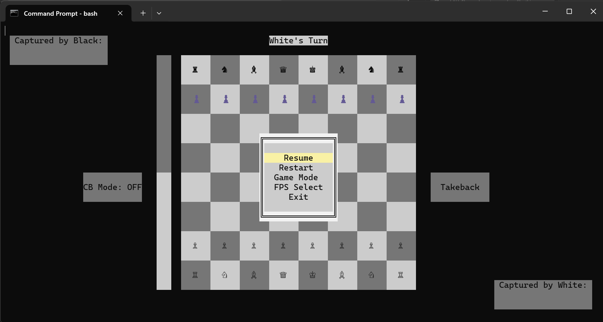
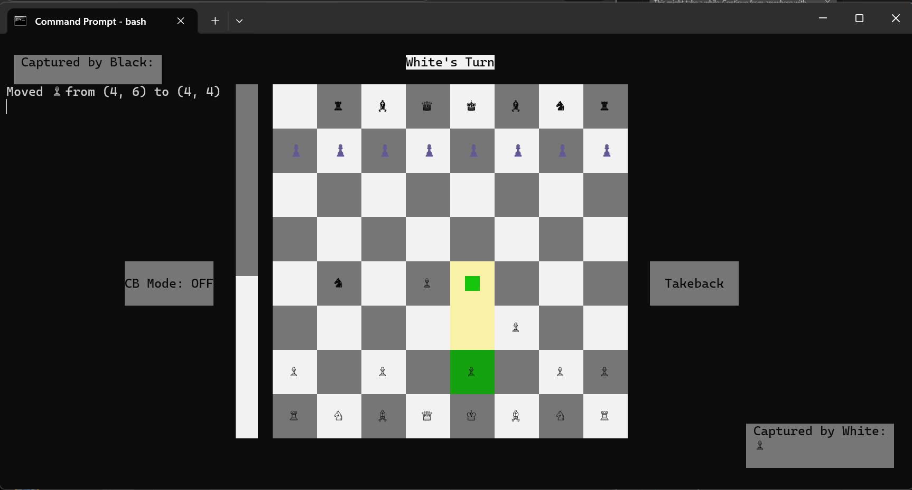
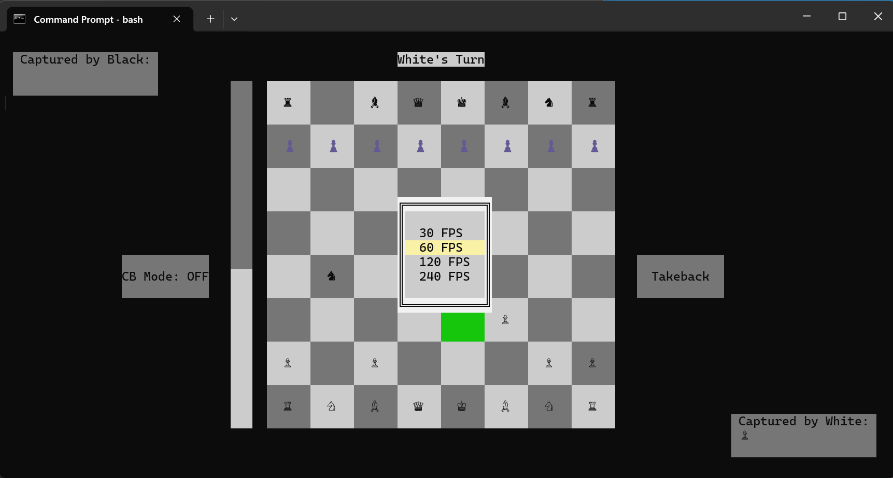
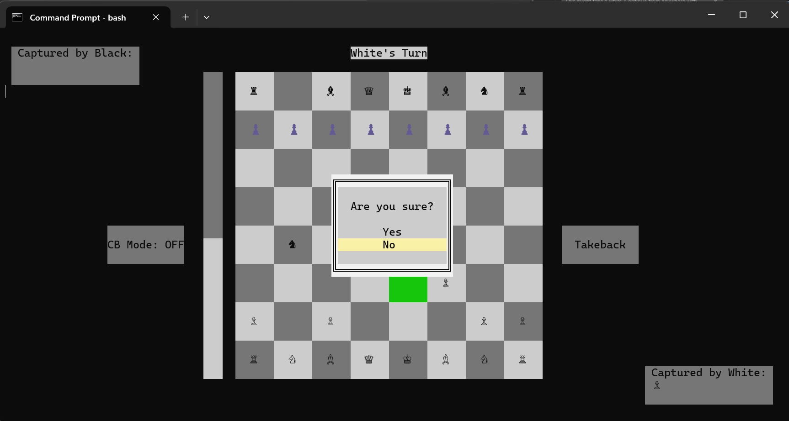
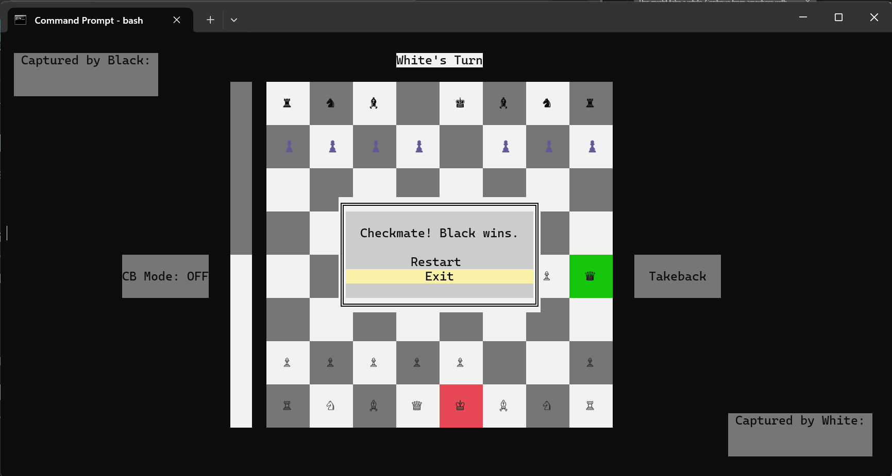
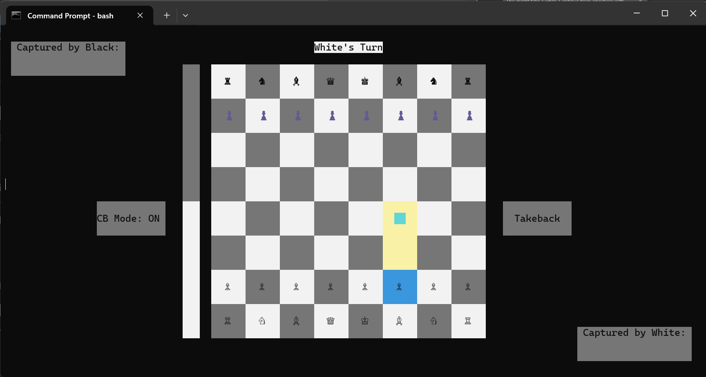

# Console Chess

A Windows CMD-based chess game written in Python featuring a custom-rendered terminal user interface (TUI), interactive menus, and a built-in AI opponent.

[](LICENSE)
[](https://discord.gg/airforce-api-1421910518129758341)

## Screenshots








## Features

### Core Gameplay
- Full chess rules implementation with Unicode chess pieces (♔♕♖♗♘♙)
- Check and checkmate detection
- Legal move validation
- Move history tracking
- Colorblind mode support
- Player vs Player (PvP) and Player vs AI modes
- Configurable AI color (play as white or black)

### Technical Features
- **Custom Windows Console Renderer**: Direct manipulation of Windows console using `ctypes` for high-performance rendering
- **Double-buffered TUI**: Separate character and attribute buffers for flicker-free display
- **Advanced AI Engine**:
  - Minimax algorithm with alpha-beta pruning (depth 4)
  - Quiescence search for tactical accuracy
  - Zobrist hashing for position identification
  - Transposition table (64MB default) for position caching
  - Material evaluation and positional scoring
  - Capture prioritization and piece safety analysis
- **Modular Architecture**: Clean separation of concerns with dedicated modules for chess logic, AI, rendering, and configuration

### User Interface
- Interactive menu system with keyboard navigation
- Bordered windows with Unicode box-drawing characters
- Color-coded piece display
- Visual feedback for selections and game states
- Settings persistence via JSON

## Project Structure

```
gamereact/
├── run.py                          # Entry point
├── src/
│   ├── ai/
│   │   ├── __init__.py
│   │   ├── engine.py               # Main AI decision-making
│   │   ├── minimax.py              # Minimax with alpha-beta pruning
│   │   ├── evaluation.py           # Position evaluation functions
│   │   ├── move_generator.py      # Fast move generation
│   │   ├── zobrist.py              # Zobrist hashing implementation
│   │   └── transposition_table.py # Position caching
│   ├── chess/
│   │   ├── __init__.py
│   │   ├── attack.py               # Square attack detection
│   │   └── move_validation.py     # Move legality checking
│   ├── core/
│   │   ├── __init__.py
│   │   └── kernel.py               # Low-level console rendering
│   ├── ui/
│   │   ├── __init__.py
│   │   └── renderer.py             # High-level UI components
│   └── config/
│       ├── __init__.py
│       └── settings.py             # Settings management
└── chess_settings.json             # User preferences (auto-generated)
```

## Requirements

- **Operating System**: Windows (uses Windows-specific console APIs)
- **Python**: 3.x
- **Dependencies**: Standard library only (no external packages required)

## Installation

1. Clone or download this repository
2. Ensure Python 3.x is installed on your Windows system
3. No additional dependencies needed!

## Run

```bash
python run.py
```

## Controls

- **Arrow Keys / WASD**: Navigate menus and select pieces
- **Enter / Space**: Confirm selections
- **ESC**: Cancel move or return to menu
- **Follow on-screen prompts**: The game will guide you through moves and options

## AI Capabilities

The AI opponent features:
- **Search Depth**: 4 plies with quiescence search extension
- **Node Limit**: 50,000 nodes per move for responsive gameplay
- **Evaluation Criteria**:
  - Material balance (standard piece values)
  - Piece safety and threat detection
  - Center control
  - Pawn advancement
  - Capture opportunities
  - Piece activity (avoiding back-rank pieces)
- **Optimization**: Transposition table reduces redundant calculations
- **Fallback Logic**: If minimax fails, uses heuristic-based move selection

Designed for responsive gameplay rather than maximum engine strength.

## Configuration

Settings are automatically saved to `chess_settings.json`:
- `colorblind_mode`: Enable/disable colorblind-friendly display
- `game_mode`: "pvp" or "ai"
- `ai_color`: "white" or "black" (which side the AI plays)

## Technical Details

### Rendering System
The game uses Windows Console API via `ctypes` for direct buffer manipulation:
- Character buffer stores displayed characters
- Attribute buffer stores color/formatting information
- Both buffers are updated simultaneously for smooth rendering

### AI Algorithm
```
minimax(position, depth, alpha, beta)
├── Transposition table lookup
├── Depth 0: Enter quiescence search
├── Generate legal moves (top 15)
├── Recursive evaluation
├── Alpha-beta pruning
└── Store result in transposition table
```

### Move Generation
- Fast pseudo-legal move generation
- Legal move validation (king safety check)
- Move scoring for move ordering
- Capture prioritization in quiescence search

## Community

Join our Discord community for support, discussions, and updates:

[](https://discord.gg/airforce-api-1421910518129758341)

## License

This project is licensed under the MIT License - see the [LICENSE](LICENSE) file for details.

## Author

Built as a personal project to explore chess engine design, terminal UI rendering,
and low-level Windows console programming in Python.
